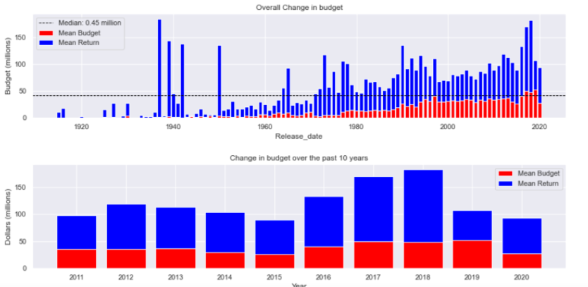
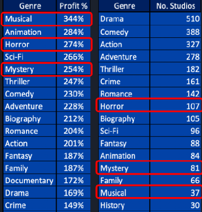
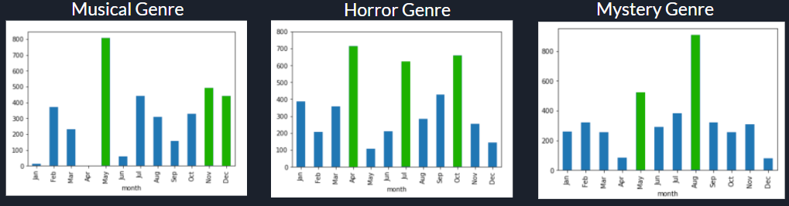
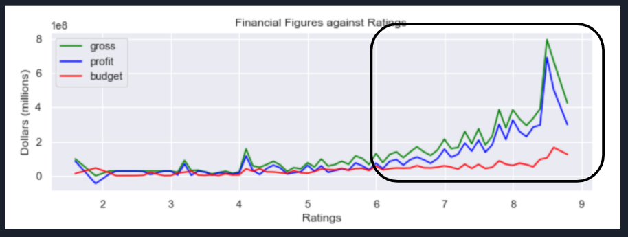
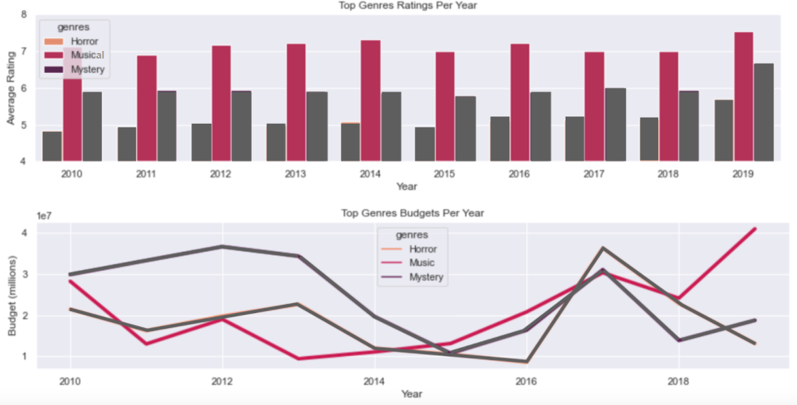
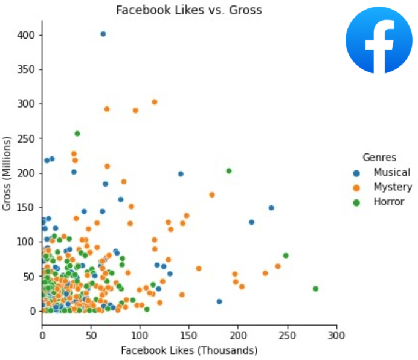

# Lights, Camera, Analysis -  Movie Data Analysis Phase 1 Project  

**Authors**: [Abass Ibrahim ](https://www.linkedin.com/in/abass-ibrahim/), [Anna Chantharasouk](https://www.linkedin.com/in/dchantharasouk/), [Ferit Yikar](https://www.linkedin.com/in/ferityikar/), [Hoang Nguyen](mailto:hvnguyen90@gmail.com), [Ross McKim](https://www.linkedin.com/in/ross-mckim/)


## Overview
This project aims to use exploratory data analysis on available movie data to make movie recommendations for key stakeholders. 

## Business Problems
In this scenario, Microsoft is creating a new movie studio and needs recommendations on the current box office. Our team plans to explore the current film industry examining the best type of films to create while providing other important insight on the movie industry.

## Data


Our Data sets are derived from the following public databases:

[IMDB](https://www.imdb.com/) <br>
[The Box Office Mojo](https://www.boxofficemojo.com/) <br>
[Rotten Tomatoes](https://www.rottentomatoes.com/) <br>
[The Movie DB](https://www.themoviedb.org/) <br>
[The Numbers](https://www.the-numbers.com/) <br>
[Kaggle](https://www.kaggle.com/carolzhangdc/imdb-5000-movie-dataset)

## Methods
Our methods consisted of explorative data analysis techniques using panda data frames. We measured profibility across different genres, months, ratings, and directors. We also weighted the averages method to prevent outlyers from skewing our data. We also explored relationships of social media engagement in the form of Facebook Likes on it's affect on gross. 

## Results

We first wanted to see if it was worth going into the industry.Examing the data set we saw a 216% return on investment on average, not including marketing costs and future sales. <br>
We see a year-on-year profit growth and an increasing cost in budget.


<br>
<br>

We examined the profits and weighed that against competition (no. of studios) in each genre and based our recommendations off of Musical, Horror, and Mystery.

<br>
<br>
We then saw the months where each movie genre is the most profitable.

<br> <br>

Next we examined ratings and saw that after a rating of 6, movies become much more profitable.

 <br><br>
We wanted to see what affected a good rating score so we examined budget. Budget seems to have a very little effect to no effect at all. 

<br><br>

Knowing this, we then explored directors data. We found the most profitable directors in each category who scored above a 6 and made our director recommendation off of that.<br>
- **Recommended director for the genre:**<br>
       * Musical: Damien Chazzelle, Bryan Singer, Elizabeth Banks, Gregory Jacobs, Bill Condon <br>
       * Horror: William Brent Bell, Tod Williams, Daniel Stamm, James DeMonaco, Jeff Wadlow<br>
       * Mystery: John Leonetti, Ariel Schulman, Henry Joost, Jordan Peele, David Sandberg
<br><br><br>

We wanted to see other factors that may affect the succes of a movie and know that social media engagement is heavily involved with our every day life. We found public data on facebook likes and examined the data. 


## Conclusion and Recommendations
Our Key recommendations are the following
- **Movies are worthwhile investments at a 216% return on investment**
- **Musical, Horror, and Mystery** are the 3 genres we recommend after assessing profiability and barrier of entry
- **Recommended release date for the genre:**<br>
       * Musical: May, Nov,  and December<br>
       * Horror:  Apr, Jul and Oct<br>
       * Mystery:  Aug and May<br>
- **Recommended director for the genre:**<br>
       * Musical: Damien Chazzelle<br>
       * Horror: William Brent Bell<br>
       * Mystery: John Leonetti

## Future Directions

We further recommend looking into socia media engagement as a metric for that may affect the success of a movie.  While we hypothesize, social media engagement to be important, our results showed that there was little correlation for our genres of interests. With this we can infer that Facebook may not be the best place to market those musical, horror, or mystery films. We recommend exploring more Facebook data as well as other social media platforms relationship to movie success as a area of future interests. 


## For More Information

To see the full analysis you can visit our [Jupyter Notebook](./Master%20Notebook.ipynb)<br>
You can also find our full slide presentations [here](./Phase-1%20Project.pdf)

## Repository Structure

```
├── data
├── images
├── Relational Schema.png
├── Master Notebook.ipynb
├── Phase-1 Project.pdf
└── README.md
```


